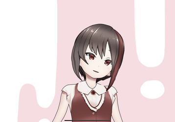
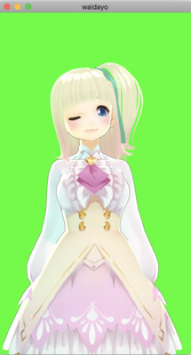

# VRMモデルとFaceTrackingでバ美肉できるiOSアプリ（PC連携含む）を比べてみた
Create: 2020/5/27  
Auther: 一夜ひいろ [@HiiroHitoyo](https://twitter.com/HiiroHitoyo "@HiiroHitoyo")  

## 背景
コロナにより空前のバ美肉ブーム！  
乗るしかないこのビッグウェーブに！！  
でも、Macで動くバ美肉ツールが無い！！！  

という理由でアプリを作った。  
せっかく作ったからには公開しようと考えた。  
が、どうやら同じようなことを考えていた人はたくさんいたようで…  
最初に探したときには見つからなかったアプリが沢山見つかってしまった！！！！  

じゃあ、比べてみて作ったアプリとどこに差異があるのか確認しようか、せっかく比べたなら結果を残しておこうかというのが背景。  

## 免責
それぞれのアプリをしっかり使い込んだわけでは無いので、間違っていたらゴメンナサイ。

## 動作確認環境
端末： iPad Pro 2018 11inch iOS 13.4.1  
PC： Mac OS Catalina 10.15.4

## 確認したアプリ一覧
- [2DR](#2DR) : https://apps.apple.com/us/app/2dr/id1471949953?l=ja
- [ZZ3D](#ZZ3D) : https://apps.apple.com/jp/app/zz3d/id1475406292
- [waidayo](#waidayo) : https://apps.apple.com/jp/app/waidayo/id1513166077
- [Koigao](#Koigao) : https://apps.apple.com/jp/app/id1507679306
- [3toneFT](#3toneFT)（PC側アプリ有料のため確認できず） : https://apps.apple.com/jp/app/3teneft/id1452730104
- [バ美肉Camera（仮）](#バ美肉camera仮) : 自作アプリ

## 2DR

単体動作：可能  
PC連携動作：不可  
iPad画面対応：対応  
画面回転：対応  
背景画像の差し替え：対応  
VRoid Hub:：非対応  

コメント：  
ARKitのFaceTrackingでは無いため、TuneDepthカメラ非搭載の端末でも動くのがメリット。  
ただし、その代償として支払った表情のトラッキング精度劣化がとても大きい…。  
表情のトラッキング精度さえよければ求めていたアプリにほぼ近いものだった。  
なお、Live2Dのモデルも読み込める。（むしろこちらがメインの模様）

参考：  
https://github.com/VNOS-official/2dr/wiki

## ZZ3D

単体動作：可能  
PC連携動作：不可  
iPad画面対応：非対応  
画面回転：非対応（横向きのままでの使用は可能）  
背景画像の差し替え：対応  
VRoid Hub:：対応  

コメント：  
顔の位置を動かすとモデルごと移動するのが他には無い特徴。  
大きな動きを付けられるが、画面外に移動してしまうこともしばしば。  
モデルごと動くので動きが若干不自然なのも少し残念。  
個人的にはiPadにあまり対応していないのが痛い。  
iPadで動作しないわけでは無いが、互換表示モードになるのと、UIがうまく操作できない。  

参考：  
https://halmin.wixsite.com/zz3d

## waidayo

単体動作：不可能では無いが限定的（メニューアイコンを消せない、白背景のみ）  
PC連携動作：可能  
iPad画面対応：対応  
画面回転：非対応（横向きのままでの使用は可能）  
背景画像の差し替え：非対応（グリーンバック）  
VRoid Hub:：スマホアプリのみ対応（PC側はVRMファイル必須）  

コメント：  
PC連携がほぼ必須だが、比べたアプリの中で一番使いやすいと感じた。  
ばもきゃと連携ができるのが大きな特徴（試してはいない）。  
ばもきゃのプロトコルに沿って通信していると思われるので、受信側アプリを自作すれば可能性は無限大のはず。  
強いて欠点をあげるなら、画面の回転に対応していないことと、首の動きは上下方向にしかオフセットがかけられないことか。（ちなみに、上方向にオフセットをかけられないバグがあるっぽい？）

参考：  
https://github.com/nmchan/waidayo/wiki

## 恋顔（Koigao）

単体動作：不可  
PC連携動作：可能  
iPad画面対応：非対応  
画面回転：非対応（横向きのままでの使用は可能）  
背景画像の差し替え：色の変更のみ対応（背景は単色）  
VRoid Hub:：非対応  

コメント：  
PC連携必須のオーソドックスなアプリ。同一ネットワークであれば、IPアドレス不要で連携できるのが便利。  
端末側は顔のトラッキング動作に徹しており、モデルの表示は無い。  
体験利用はできるものの有料のアプリ。  
欲を言えばPC側のUnityアプリはウィンドウサイズを可変にして欲しかった。  
noteでは表情の表現の幅を広げることに言及していたので今後に期待。  

参考：  
https://note.com/hirarichan/n/n59373c645887  
https://hiragram.github.io/koigao-website/  

## 3toneFT
動作確認できなかったため画像略  

単体動作：不可  
PC連携動作：可能  
iPad画面対応：非対応  
画面回転：非対応  
背景画像の差し替え：不明  
VRoid Hub:：不明  

コメント：  
PCと連携して使うアプリだたが、有料ということで動作確認できなかった。  
調査して見つけたので載せるだけ載せておく。  

参考：  
https://3tene.github.io/WebDocument/#ft_iphone.md

## バ美肉Camera（仮）
※個人的に作っていたアプリ  

単体動作：可能  
PC連携動作：不可  
iPad画面対応：対応  
画面回転：対応  
背景画像の差し替え：可能  
VRoid Hub:：非対応（現時点では）  

コメント：  
iPadに対応していること、前後や左右に大きく動けることが他のアプリとの大きな違いか。  
そのため、ビデオチャットのカメラ替りにする用途には向いているが、プレゼンの右下に常時表示するような用途には向いていないと思われる。  
なお、カメラ座標を基準にモデルを表示しているので、端末を持って移動しても位置や向きが変わらないという特徴もある。  

## まとめ
みんないろいろな特徴があって面白い！  
個人的に作っていたアプリは他のアプリと差異がだせそうだからこのままアプリ登録に持っていくぜ！